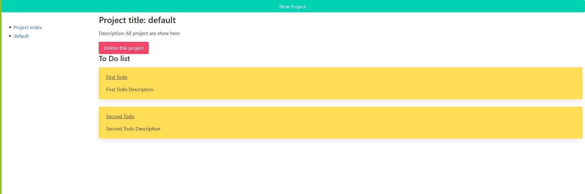

<!-- PROJECT SHIELDS -->
<!--
*** I'm using markdown "reference style" links for readability.
*** Reference links are enclosed in brackets [ ] instead of parentheses ( ).
*** See the bottom of this document for the declaration of the reference variables
*** for contributors-url, forks-url, etc. This is an optional, concise syntax you may use.
*** https://www.markdownguide.org/basic-syntax/#reference-style-links
-->

[![Contributors][contributors-shield]][contributors-url]
[![Forks][forks-shield]][forks-url]
[![Stargazers][stars-shield]][stars-url]
[![Issues][issues-shield]][issues-url]
[![MIT License][license-shield]][license-url]
[![LinkedIn][linkedin-shield]][linkedin-url]

<!-- PROJECT LOGO -->
<br />
<p align="center">
  

  <h3 class ="norse" align="center" style="@font-face {font-family: 'Norse'; src: url('/fonts/Norse.otf'); font-family:'Norse'}">ToDo List</h3>

  <p align="center">
    Small Note Creating app
    <br />
    <br />
  </p>
</p>

<!-- TABLE OF CONTENTS -->

## Table of Contents

- [Table of Contents](#table-of-contents)
- [About The Project](#about-the-project)
  - [Built With](#built-with)
- [Getting Started](#getting-started)
  - [Installation](#installation)
- [Usage](#usage)
- [Contact](#contact)
- [Contributing](#contributing)
- [Show your support](#show-your-support)
- [Acknowledgments](#acknowledgments)
- [License](#license)

<!-- ABOUT THE PROJECT -->

## About The Project


This is a project of the Javascript module. It is preceded by the lesson about Objects Oriented Programming and Functional Programming.

Project: JavaScript project, small list ToDo app. [Assignment link](https://www.theodinproject.com/courses/javascript/lessons/todo-list)

Visit the finished project website: [Live](https://jdmartinez1062.github.io/to-do/)
<div style="text-align:center">
  <a href="https://jdmartinez1062.github.io/to-do/">
      
  </a>
</div>

### Built With

- [JavaScript](https://www.javascript.com)
- [Bulma](https://bulma.io/)

## Getting Started

### Installation

1. Clone the repo

```sh
git clone https://github.com/jdmartinez1062/to-do
```
<!-- USAGE EXAMPLES -->
## Usage

1. Open local server.

2. Click the button "New Project"

3. Fill in the proper inputs as requested in the Form.

4. You can add a "New ToDo", where you can fill in what you need to do for the project.
   
5. You can add later a checklist to keep track of what needs to be done for the project.

6. Click on "Create New Project" to create the new project.

7. On the sidebar you can navigate into the created projects.
   
8. On the Project Index tab, you can check every project created. 

## Contact

Juan David Martínez Cubillos - jd.martinez1062@gmail.com

Carlos Henrique da Veiga - carlosveigadev@gmail.com


## Contributing

Contributions, issues and feature requests are welcome!

Feel free to check the [issues page](issues/).

## Show your support

Give a ⭐️ if you like this project!

## Acknowledgments

- Microverse for the opportunity.

## License

This project is [MIT](lic.url) licensed.


<!-- ACKNOWLEDGEMENTS -->


<!-- MARKDOWN LINKS & IMAGES -->
<!-- https://www.markdownguide.org/basic-syntax/#reference-style-links -->

[contributors-shield]: https://img.shields.io/github/contributors/jdmartinez1062/to-do.svg?style=flat-square
[contributors-url]: https://github.com/jdmartinez1062/to-do/graphs/contributors
[forks-shield]: https://img.shields.io/github/forks/jdmartinez1062/to-do.svg?style=flat-square
[forks-url]: https://github.com/jdmartinez1062/to-do/network/members
[stars-shield]: https://img.shields.io/github/stars/jdmartinez1062/to-do.svg?style=flat-square
[stars-url]: https://github.com/jdmartinez1062/to-do/stargazers
[issues-shield]: https://img.shields.io/github/issues/jdmartinez1062/to-do.svg?style=flat-square
[issues-url]: https://github.com/jdmartinez1062/to-do/issues
[license-shield]: https://img.shields.io/github/license/jdmartinez1062/to-do.svg?style=flat-square
[license-url]: https://github.com/jdmartinez1062/to-do/blob/master/LICENSE.txt
[linkedin-shield]: https://img.shields.io/badge/-LinkedIn-black.svg?style=flat-square&logo=linkedin&colorB=555
[linkedin-url]: https://linkedin.com/in/othneildrew
[product-screenshot]: imgs/screenshot.jpg

